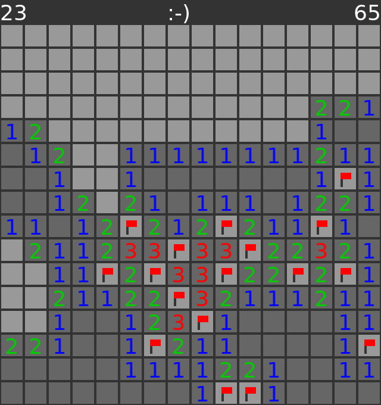

# scuffed-mines

A really bad implementation of Minesweeper in Lua



## Quick Start

Install the [LÖVE](https://love2d.org/) game framework.

Then go to the project root, and run

```
$ love .
```

to start the game.

## Controls

**Mouse:**

 - Left click: Reveal a tile.
 - Right click: Flag a tile.
 - Middle click: Perform a "chord" where a revealed tile with the correct number of flags has all hidden tiles revealed.

**Keyboard:**

 - 1/2/3: Start an easy/medium/hard game (you can also click on the smiley face at the top)
 - Escape: Exit the game

 ## Game Configuration

You can modify the window/tile scaling through the `tile_size` variable.
